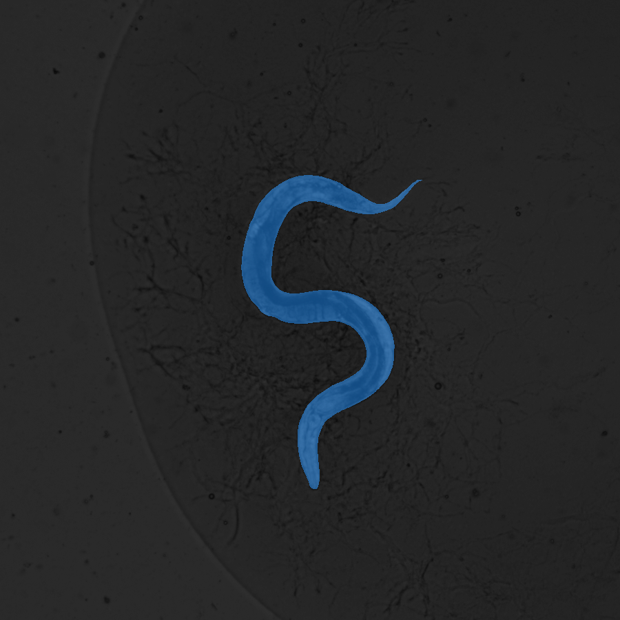

# SegmentAnyWorm

Generic C. elegans segmentation using YOLOv8 + SAM

## Installation

Install ultralytics:

`pip install ultralytics`

Install segment anything:

`pip install git+https://github.com/facebookresearch/segment-anything.git`

Or just run:

`pip install -r requirements.txt`

And download a [SAM checkpoint](https://github.com/facebookresearch/segment-anything#model-checkpoints)

## Inference

To perform inference run:

`python detect.py --data path/to/imgs --output path/for/output`

Check arguments with:

`python detect.py --help`

## Finetuning

Knowing that the SAM segmentation will only be as good as the YOLO detection, finetuning for this model is recomended.

The model can be finetuned running:

`python finetune.py --data path/to/data.yaml`

Check the training arguments on the [YOLOv8 docs](https://docs.ultralytics.com/modes/train/#arguments)

## Visualize

To visualize the segmentation run:

`python draw.py`

## Acknowledgements

[Ultralytics YOLOv8](https://github.com/ultralytics/ultralytics)

[Meta AI SAM](https://github.com/facebookresearch/segment-anything)
